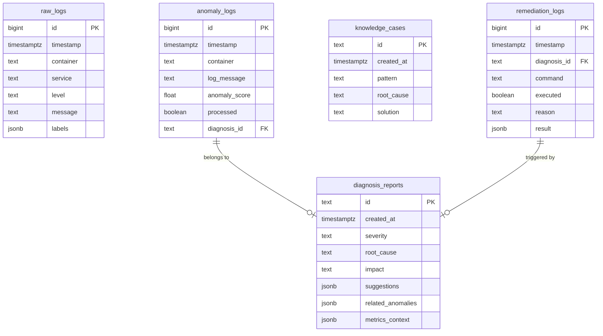

# Database Schema

## Overview

系統使用 [[TimescaleDB]] (PostgreSQL 擴展) 作為主要資料庫，存儲日誌、異常和診斷報告。

## Tables

### raw_logs

永久存儲的 RAW 日誌，使用 Hypertable 進行時序優化。

```sql
CREATE TABLE raw_logs (
    id BIGSERIAL,
    timestamp TIMESTAMPTZ NOT NULL,
    container TEXT,
    service TEXT,
    level TEXT,
    message TEXT,
    labels JSONB,
    PRIMARY KEY (id, timestamp)
);

-- Convert to Hypertable (partitioned by time)
SELECT create_hypertable('raw_logs', 'timestamp');

-- Compression policy (compress data older than 7 days)
SELECT add_compression_policy('raw_logs', INTERVAL '7 days');

-- Indexes
CREATE INDEX idx_raw_logs_container ON raw_logs(container, timestamp DESC);
CREATE INDEX idx_raw_logs_level ON raw_logs(level, timestamp DESC);
```

### anomaly_logs

[[Layer 1 Filter]] 檢測到的異常日誌。

```sql
CREATE TABLE anomaly_logs (
    id BIGSERIAL PRIMARY KEY,
    timestamp TIMESTAMPTZ NOT NULL DEFAULT NOW(),
    container TEXT NOT NULL,
    log_message TEXT NOT NULL,
    anomaly_score FLOAT NOT NULL,
    processed BOOLEAN DEFAULT FALSE,
    diagnosis_id TEXT,
    created_at TIMESTAMPTZ DEFAULT NOW()
);

-- Index for unprocessed anomalies
CREATE INDEX idx_anomaly_unprocessed 
ON anomaly_logs(timestamp DESC) 
WHERE processed = FALSE;

-- Index for diagnosis lookup
CREATE INDEX idx_anomaly_diagnosis 
ON anomaly_logs(diagnosis_id) 
WHERE diagnosis_id IS NOT NULL;
```

### diagnosis_reports

[[Layer 2 - Root Cause Analysis]] 生成的診斷報告。

```sql
CREATE TABLE diagnosis_reports (
    id TEXT PRIMARY KEY,
    created_at TIMESTAMPTZ NOT NULL DEFAULT NOW(),
    severity TEXT NOT NULL CHECK (severity IN ('low', 'medium', 'high', 'critical')),
    root_cause TEXT NOT NULL,
    impact TEXT,
    suggestions JSONB NOT NULL DEFAULT '[]',
    related_anomalies JSONB,
    metrics_context JSONB,
    llm_model TEXT,
    confidence FLOAT
);

-- Index for recent reports
CREATE INDEX idx_diagnosis_created 
ON diagnosis_reports(created_at DESC);

-- Index for severity filtering
CREATE INDEX idx_diagnosis_severity 
ON diagnosis_reports(severity, created_at DESC);
```

### knowledge_cases

[[Knowledge Base]] 的 SQL 備份（主要存儲在 ChromaDB）。

```sql
CREATE TABLE knowledge_cases (
    id TEXT PRIMARY KEY,
    created_at TIMESTAMPTZ NOT NULL DEFAULT NOW(),
    pattern TEXT NOT NULL,
    root_cause TEXT NOT NULL,
    solution TEXT NOT NULL,
    severity TEXT,
    container_pattern TEXT,
    success_rate FLOAT,
    use_count INTEGER DEFAULT 0
);

-- Full-text search
CREATE INDEX idx_knowledge_pattern_fts 
ON knowledge_cases USING gin(to_tsvector('english', pattern || ' ' || root_cause));
```

### remediation_logs

自動修復操作的審計日誌。

```sql
CREATE TABLE remediation_logs (
    id BIGSERIAL PRIMARY KEY,
    timestamp TIMESTAMPTZ NOT NULL DEFAULT NOW(),
    diagnosis_id TEXT REFERENCES diagnosis_reports(id),
    command TEXT,
    executed BOOLEAN NOT NULL,
    reason TEXT,
    result JSONB,
    operator TEXT DEFAULT 'auto'
);

-- Index for audit queries
CREATE INDEX idx_remediation_timestamp 
ON remediation_logs(timestamp DESC);
```

## Retention Policies

```sql
-- Raw logs: 永久保存，壓縮 7 天以上數據
SELECT add_compression_policy('raw_logs', INTERVAL '7 days');

-- Anomaly logs: 保留 90 天
SELECT add_retention_policy('anomaly_logs', INTERVAL '90 days');

-- Diagnosis reports: 保留 1 年
SELECT add_retention_policy('diagnosis_reports', INTERVAL '1 year');

-- Knowledge cases: 永久保存
-- (no retention policy)

-- Remediation logs: 保留 1 年
SELECT add_retention_policy('remediation_logs', INTERVAL '1 year');
```

## ER Diagram



## Common Queries

### Recent Anomalies

```sql
SELECT * FROM anomaly_logs
WHERE processed = FALSE
ORDER BY timestamp DESC
LIMIT 100;
```

### Diagnosis by Severity

```sql
SELECT severity, COUNT(*) 
FROM diagnosis_reports
WHERE created_at > NOW() - INTERVAL '24 hours'
GROUP BY severity;
```

### Hourly Anomaly Trend

```sql
SELECT 
    date_trunc('hour', timestamp) as hour,
    COUNT(*) as count
FROM anomaly_logs
WHERE timestamp > NOW() - INTERVAL '24 hours'
GROUP BY hour
ORDER BY hour;
```

## Related

- [[TimescaleDB]] - 資料庫技術
- [[Layer 0 - Data Collection]] - raw_logs
- [[Layer 1 - Anomaly Filtering]] - anomaly_logs
- [[Layer 2 - Root Cause Analysis]] - diagnosis_reports
