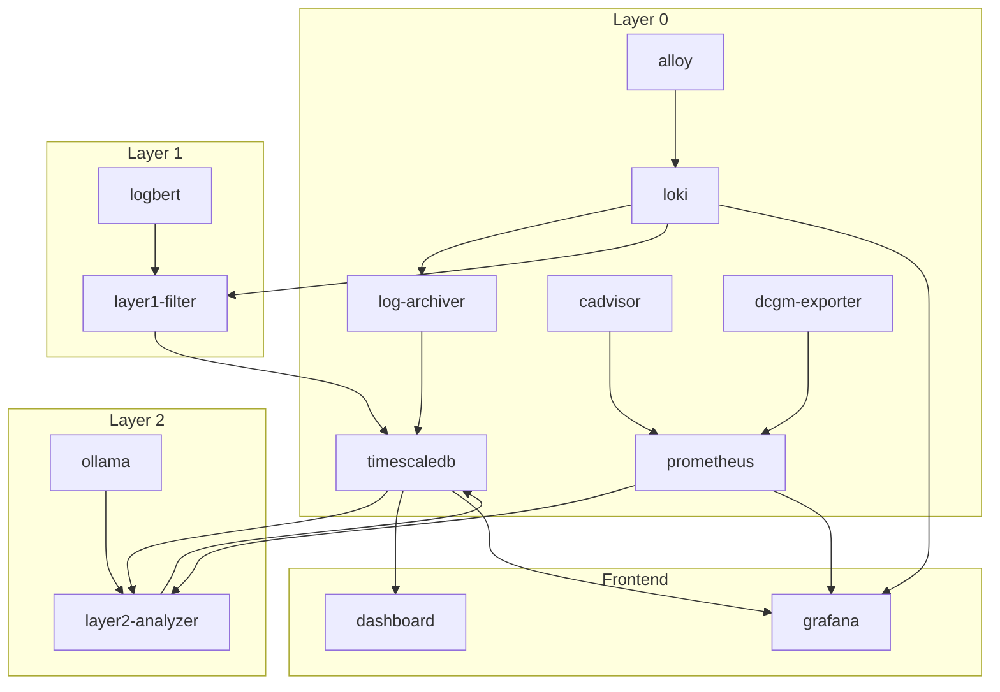

# Docker Compose Services

## Overview

所有服務透過 `docker-compose.yaml` 統一管理。

## Service Map

| Service | Layer | Port | Image |
|---------|-------|------|-------|
| `loki` | 0 | 3100 | grafana/loki:2.9.0 |
| `prometheus` | 0 | 9090 | prom/prometheus:v2.45.0 |
| `cadvisor` | 0 | 8081 | gcr.io/cadvisor/cadvisor:v0.47.0 |
| `dcgm-exporter` | 0 | 9400 | nvidia/dcgm-exporter |
| `alloy` | 0 | 12345 | grafana/alloy:latest |
| `timescaledb` | 0 | 5432 | timescale/timescaledb:latest-pg15 |
| `log-archiver` | 0 | - | custom |
| `layer1-filter` | 1 | - | custom |
| `logbert` | 1 | - | custom (GPU) |
| `layer2-analyzer` | 2 | - | custom |
| `ollama` | external | 11434 | ollama/ollama |
| `grafana` | viz | 3000 | grafana/grafana:10.0.0 |
| `dashboard` | frontend | 5000 | custom |

## Dependency Graph



## Quick Commands

```bash
# Start all services
docker-compose up -d

# Start specific service
docker-compose up -d layer2-analyzer

# View logs
docker-compose logs -f layer1-filter

# Restart service
docker-compose restart layer2-analyzer

# Stop all
docker-compose down
```

## Resource Requirements

| Service | CPU | Memory | GPU |
|---------|-----|--------|-----|
| logbert | 2 | 4GB | 1 (8GB VRAM) |
| layer2-analyzer | 1 | 2GB | - |
| timescaledb | 2 | 4GB | - |
| loki | 1 | 2GB | - |
| prometheus | 1 | 1GB | - |
| ollama | 2 | 8GB | 1 (optional) |

## Environment Variables

See `.env.example` for all available variables.

## Related

- [[Layer 0 - Data Collection]]
- [[Layer 1 - Anomaly Filtering]]
- [[Layer 2 - Root Cause Analysis]]
