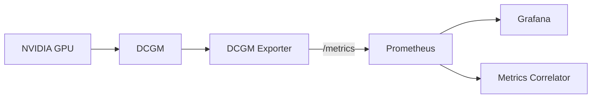

# DCGM Exporter

## Overview

DCGM (Data Center GPU Manager) Exporter 是 NVIDIA 官方的 GPU 指標導出工具，將 DCGM 收集的 GPU 指標轉換為 Prometheus 格式。

## Role in System

在 AI Auto Debug System 中，DCGM Exporter 負責：
- 收集 NVIDIA GPU 的使用指標
- 監控 [[LogBERT]] 等 GPU 密集型服務的資源使用
- 將指標暴露給 [[Prometheus]] 抓取

## Prerequisites

- NVIDIA GPU driver 已安裝
- NVIDIA Container Toolkit 已配置

## Docker Compose

```yaml
dcgm-exporter:
  image: nvidia/dcgm-exporter:3.1.7-3.1.4-ubuntu20.04
  ports:
    - "9400:9400"
  deploy:
    resources:
      reservations:
        devices:
          - driver: nvidia
            count: all
            capabilities: [gpu]
  environment:
    - DCGM_EXPORTER_LISTEN=:9400
    - DCGM_EXPORTER_KUBERNETES=false
```

## Key Metrics

| Metric | Description |
|--------|-------------|
| `DCGM_FI_DEV_GPU_UTIL` | GPU 使用率 (%) |
| `DCGM_FI_DEV_MEM_COPY_UTIL` | 記憶體複製使用率 (%) |
| `DCGM_FI_DEV_FB_FREE` | Framebuffer 可用記憶體 (MB) |
| `DCGM_FI_DEV_FB_USED` | Framebuffer 已用記憶體 (MB) |
| `DCGM_FI_DEV_POWER_USAGE` | 當前功耗 (W) |
| `DCGM_FI_DEV_TOTAL_ENERGY_CONSUMPTION` | 總能耗 (J) |
| `DCGM_FI_DEV_GPU_TEMP` | GPU 溫度 (°C) |
| `DCGM_FI_DEV_SM_CLOCK` | SM 時脈 (MHz) |
| `DCGM_FI_DEV_MEM_CLOCK` | 記憶體時脈 (MHz) |
| `DCGM_FI_DEV_PCIE_TX_THROUGHPUT` | PCIe 傳輸吞吐量 |
| `DCGM_FI_DEV_PCIE_RX_THROUGHPUT` | PCIe 接收吞吐量 |

## Labels

| Label | Description |
|-------|-------------|
| `gpu` | GPU 索引 |
| `UUID` | GPU UUID |
| `device` | 設備名稱 |
| `modelName` | GPU 型號 |
| `Hostname` | 主機名稱 |

## PromQL Examples

```promql
# GPU 使用率
DCGM_FI_DEV_GPU_UTIL

# GPU 記憶體使用量 (GB)
DCGM_FI_DEV_FB_USED / 1024

# GPU 溫度
DCGM_FI_DEV_GPU_TEMP

# GPU 功耗
DCGM_FI_DEV_POWER_USAGE

# 高 GPU 使用率告警
DCGM_FI_DEV_GPU_UTIL > 90
```

## Integration with LogBERT

當 [[LogBERT]] 執行異常檢測時，GPU 指標可幫助識別：
- 模型推理是否正常運行
- 是否有 GPU OOM 問題
- 推理延遲是否與 GPU 負載相關

## Data Flow



## Troubleshooting

### GPU Not Detected
```bash
# 確認 NVIDIA driver
nvidia-smi

# 確認 NVIDIA Container Toolkit
docker run --rm --gpus all nvidia/cuda:11.0-base nvidia-smi
```

### Metrics Not Available
```bash
# 檢查 DCGM Exporter 日誌
docker logs dcgm-exporter

# 手動測試指標端點
curl http://localhost:9400/metrics
```

## Related

- [[Prometheus]] - 指標存儲
- [[LogBERT]] - GPU 消費者
- [[Metrics Correlator]] - 異常關聯

## References

- [DCGM Exporter GitHub](https://github.com/NVIDIA/dcgm-exporter)
- [DCGM Documentation](https://docs.nvidia.com/datacenter/dcgm/latest/)
