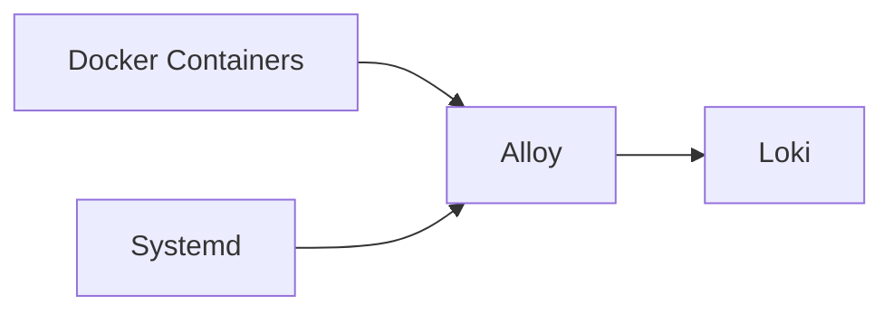

# Grafana Alloy

## Overview

Grafana Alloy 是一個開源的可觀測性數據收集器，前身為 Grafana Agent。它負責從各種來源收集日誌、指標和追蹤數據。

## Role in System

在 AI Auto Debug System 中，Alloy 負責：
- 收集所有 Docker 容器的日誌
- 收集 systemd 服務日誌
- 將日誌推送到 [[Loki]]

## Configuration

**配置文件位置:** `layer0-collector/alloy/config.alloy`

```alloy
// Docker logs collection
loki.source.docker "containers" {
  host       = "unix:///var/run/docker.sock"
  targets    = discovery.docker.containers.targets
  forward_to = [loki.write.default.receiver]
}

// Forward to Loki
loki.write "default" {
  endpoint {
    url = "http://loki:3100/loki/api/v1/push"
  }
}
```

## Docker Compose

```yaml
alloy:
  image: grafana/alloy:latest
  volumes:
    - ./layer0-collector/alloy/config.alloy:/etc/alloy/config.alloy
    - /var/run/docker.sock:/var/run/docker.sock:ro
    - /var/log:/var/log:ro
  command:
    - run
    - /etc/alloy/config.alloy
  ports:
    - "12345:12345"
```

## Data Flow



## Key Features

- **Service Discovery:** 自動發現 Docker 容器
- **Label Enrichment:** 自動添加容器元數據標籤
- **Buffering:** 內建緩衝機制防止數據丟失
- **Backpressure:** 支援背壓處理

## Related

- [[Loki]] - 日誌接收端
- [[Layer 0 - Data Collection]]
- [[Docker Compose Services]]

## References

- [Grafana Alloy Documentation](https://grafana.com/docs/alloy/latest/)
- [Alloy GitHub](https://github.com/grafana/alloy)
