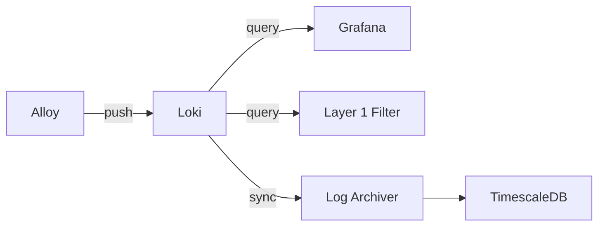

# Loki

## Overview

Loki 是 Grafana Labs 開發的日誌聚合系統，設計理念是「像 Prometheus，但用於日誌」。它不對日誌內容建立索引，而是對標籤建立索引，使其更輕量高效。

## Role in System

在 AI Auto Debug System 中，Loki 負責：
- 接收 [[Grafana Alloy]] 推送的日誌
- 提供日誌查詢 API
- 支援 [[Layer 1 Filter]] 拉取日誌進行異常檢測
- 提供 [[Grafana Dashboard]] 日誌可視化

## Configuration

**配置文件位置:** `layer0-collector/loki/loki-config.yaml`

```yaml
auth_enabled: false

server:
  http_listen_port: 3100
  grpc_listen_port: 9096

common:
  path_prefix: /loki
  storage:
    filesystem:
      chunks_directory: /loki/chunks
      rules_directory: /loki/rules
  replication_factor: 1
  ring:
    instance_addr: 127.0.0.1
    kvstore:
      store: inmemory

limits_config:
  retention_period: 744h  # 31 days

schema_config:
  configs:
    - from: 2020-10-24
      store: boltdb-shipper
      object_store: filesystem
      schema: v11
      index:
        prefix: index_
        period: 24h
```

## Docker Compose

```yaml
loki:
  image: grafana/loki:2.9.0
  ports:
    - "3100:3100"
  volumes:
    - ./layer0-collector/loki/loki-config.yaml:/etc/loki/local-config.yaml
    - loki-data:/loki
  command: -config.file=/etc/loki/local-config.yaml
```

## API Endpoints

| Endpoint | Method | Description |
|----------|--------|-------------|
| `/loki/api/v1/push` | POST | 推送日誌 |
| `/loki/api/v1/query` | GET | 即時查詢 |
| `/loki/api/v1/query_range` | GET | 範圍查詢 |
| `/loki/api/v1/labels` | GET | 獲取標籤 |
| `/loki/api/v1/tail` | GET | WebSocket 尾部追蹤 |

## LogQL Examples

```logql
# 查詢特定容器的日誌
{container="layer1-filter"} |= "error"

# 過濾異常日誌
{job="docker"} |~ "(?i)(error|exception|fail)"

# 統計錯誤數量
sum(count_over_time({container=~".+"} |= "error" [5m])) by (container)
```

## Data Flow



## Storage

- **保留期限:** 31 天
- **索引方式:** BoltDB Shipper
- **存儲位置:** Docker Volume `loki-data`

## Related

- [[Grafana Alloy]] - 日誌來源
- [[Log Archiver]] - 同步到 TimescaleDB
- [[Layer 1 Filter]] - 日誌消費者
- [[Grafana Dashboard]] - 可視化

## References

- [Loki Documentation](https://grafana.com/docs/loki/latest/)
- [LogQL Documentation](https://grafana.com/docs/loki/latest/logql/)
