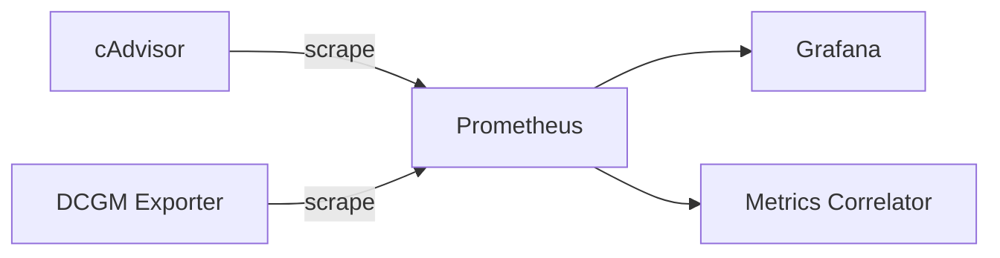

# Prometheus

## Overview

Prometheus 是一個開源的監控和告警系統，使用拉取模式收集時序指標數據。它是 CNCF 畢業專案，廣泛用於雲原生監控。

## Role in System

在 AI Auto Debug System 中，Prometheus 負責：
- 收集容器資源指標（CPU、Memory）
- 收集 GPU 指標（透過 [[DCGM Exporter]]）
- 提供指標給 [[Metrics Correlator]] 進行異常關聯
- 提供 [[Grafana Dashboard]] 指標可視化

## Configuration

**配置文件位置:** `prometheus/prometheus.yaml`

```yaml
global:
  scrape_interval: 15s
  evaluation_interval: 15s

scrape_configs:
  # Prometheus 自身
  - job_name: 'prometheus'
    static_configs:
      - targets: ['localhost:9090']

  # cAdvisor 容器指標
  - job_name: 'cadvisor'
    static_configs:
      - targets: ['cadvisor:8081']

  # DCGM GPU 指標
  - job_name: 'dcgm'
    static_configs:
      - targets: ['dcgm-exporter:9400']

  # Docker daemon 指標
  - job_name: 'docker'
    static_configs:
      - targets: ['host.docker.internal:9323']
```

## Docker Compose

```yaml
prometheus:
  image: prom/prometheus:v2.45.0
  ports:
    - "9090:9090"
  volumes:
    - ./prometheus/prometheus.yaml:/etc/prometheus/prometheus.yml
    - prometheus-data:/prometheus
  command:
    - '--config.file=/etc/prometheus/prometheus.yml'
    - '--storage.tsdb.path=/prometheus'
    - '--storage.tsdb.retention.time=15d'
```

## Key Metrics

### Container Metrics (from cAdvisor)

| Metric | Description |
|--------|-------------|
| `container_cpu_usage_seconds_total` | CPU 使用時間 |
| `container_memory_usage_bytes` | 記憶體使用量 |
| `container_network_receive_bytes_total` | 網路接收位元組 |
| `container_fs_usage_bytes` | 檔案系統使用量 |

### GPU Metrics (from DCGM)

| Metric | Description |
|--------|-------------|
| `DCGM_FI_DEV_GPU_UTIL` | GPU 使用率 |
| `DCGM_FI_DEV_MEM_COPY_UTIL` | 記憶體複製使用率 |
| `DCGM_FI_DEV_FB_USED` | Framebuffer 使用量 |
| `DCGM_FI_DEV_POWER_USAGE` | 功耗 |

## PromQL Examples

```promql
# 容器 CPU 使用率
rate(container_cpu_usage_seconds_total{name=~".+"}[5m]) * 100

# 容器記憶體使用量 (MB)
container_memory_usage_bytes{name=~".+"} / 1024 / 1024

# GPU 使用率
DCGM_FI_DEV_GPU_UTIL

# 高 CPU 告警
container_cpu_usage_seconds_total{name=~".+"} > 0.8
```

## API Endpoints

| Endpoint | Method | Description |
|----------|--------|-------------|
| `/api/v1/query` | GET/POST | 即時查詢 |
| `/api/v1/query_range` | GET/POST | 範圍查詢 |
| `/api/v1/labels` | GET | 獲取標籤 |
| `/api/v1/targets` | GET | 獲取抓取目標 |

## Integration with Layer 2

[[Metrics Correlator]] 使用 Prometheus API 關聯異常與系統指標：

```python
async def query_prometheus(query: str, time_range: tuple):
    url = f"{PROMETHEUS_URL}/api/v1/query_range"
    params = {
        "query": query,
        "start": time_range[0].isoformat(),
        "end": time_range[1].isoformat(),
        "step": "15s"
    }
    async with aiohttp.ClientSession() as session:
        async with session.get(url, params=params) as resp:
            return await resp.json()
```

## Data Flow



## Related

- [[cAdvisor]] - 容器指標來源
- [[DCGM Exporter]] - GPU 指標來源
- [[Metrics Correlator]] - 指標消費者
- [[Grafana Dashboard]] - 可視化

## References

- [Prometheus Documentation](https://prometheus.io/docs/)
- [PromQL Basics](https://prometheus.io/docs/prometheus/latest/querying/basics/)
