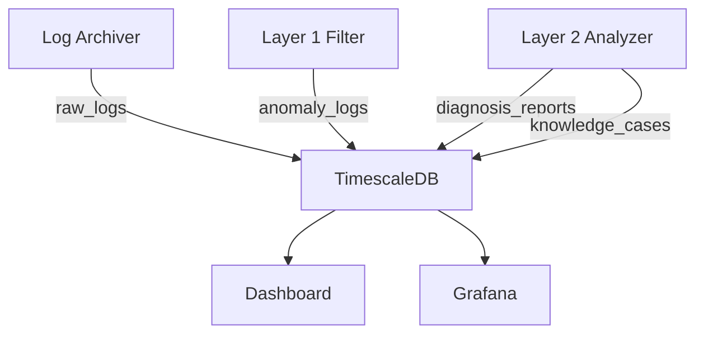

# TimescaleDB

## Overview

TimescaleDB 是建立在 PostgreSQL 之上的時序資料庫擴展，提供自動分區（Hypertable）、壓縮、連續聚合等時序數據優化功能。

## Role in System

在 AI Auto Debug System 中，TimescaleDB 負責：
- 永久存儲 RAW 日誌（透過 [[Log Archiver]] 從 Loki 同步）
- 存儲異常日誌（[[Layer 1 Filter]] 輸出）
- 存儲診斷報告（[[Layer 2 - Root Cause Analysis]] 輸出）
- 存儲知識庫案例

## Database Schema

**初始化腳本:** `layer0-storage/timescaledb/init.sql`

### Tables

#### raw_logs
```sql
CREATE TABLE raw_logs (
    id BIGSERIAL,
    timestamp TIMESTAMPTZ NOT NULL,
    container TEXT,
    service TEXT,
    level TEXT,
    message TEXT,
    labels JSONB,
    PRIMARY KEY (id, timestamp)
);

-- Convert to Hypertable
SELECT create_hypertable('raw_logs', 'timestamp');

-- Compression policy
SELECT add_compression_policy('raw_logs', INTERVAL '7 days');
```

#### anomaly_logs
```sql
CREATE TABLE anomaly_logs (
    id BIGSERIAL PRIMARY KEY,
    timestamp TIMESTAMPTZ NOT NULL DEFAULT NOW(),
    container TEXT,
    log_message TEXT,
    anomaly_score FLOAT,
    processed BOOLEAN DEFAULT FALSE,
    diagnosis_id TEXT
);

CREATE INDEX idx_anomaly_unprocessed 
ON anomaly_logs(timestamp) WHERE processed = FALSE;
```

#### diagnosis_reports
```sql
CREATE TABLE diagnosis_reports (
    id TEXT PRIMARY KEY,
    created_at TIMESTAMPTZ NOT NULL DEFAULT NOW(),
    severity TEXT,
    root_cause TEXT,
    suggestions JSONB,
    related_anomalies JSONB,
    metrics_context JSONB
);
```

#### knowledge_cases
```sql
CREATE TABLE knowledge_cases (
    id TEXT PRIMARY KEY,
    created_at TIMESTAMPTZ NOT NULL DEFAULT NOW(),
    pattern TEXT,
    root_cause TEXT,
    solution TEXT,
    embedding VECTOR(1536)
);
```

## Docker Compose

```yaml
timescaledb:
  image: timescale/timescaledb:latest-pg15
  ports:
    - "5432:5432"
  environment:
    POSTGRES_USER: postgres
    POSTGRES_PASSWORD: ${POSTGRES_PASSWORD}
    POSTGRES_DB: autodebug
  volumes:
    - ./layer0-storage/timescaledb/init.sql:/docker-entrypoint-initdb.d/init.sql
    - timescale-data:/var/lib/postgresql/data
```

## Retention Policy

**配置文件:** `layer0-storage/timescaledb/retention.sql`

```sql
-- Raw logs: 永久保存，但壓縮 7 天以上的數據
SELECT add_compression_policy('raw_logs', INTERVAL '7 days');

-- Anomaly logs: 保留 90 天
SELECT add_retention_policy('anomaly_logs', INTERVAL '90 days');

-- Diagnosis reports: 保留 1 年
SELECT add_retention_policy('diagnosis_reports', INTERVAL '1 year');
```

## Connection

```python
import asyncpg

async def get_connection():
    return await asyncpg.connect(
        host='timescaledb',
        port=5432,
        user='postgres',
        password=os.environ['POSTGRES_PASSWORD'],
        database='autodebug'
    )
```

## Data Flow



## Related

- [[Log Archiver]] - 日誌同步
- [[Layer 1 Filter]] - 異常寫入
- [[Layer 2 - Root Cause Analysis]] - 診斷報告
- [[Database Schema]] - 完整 Schema

## References

- [TimescaleDB Documentation](https://docs.timescale.com/)
- [Hypertables](https://docs.timescale.com/use-timescale/latest/hypertables/)
