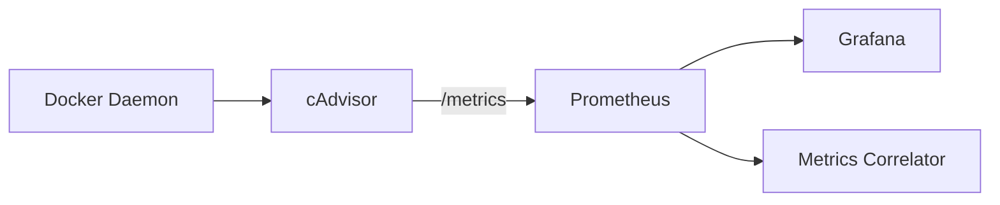

# cAdvisor

## Overview

cAdvisor (Container Advisor) 是 Google 開發的容器資源監控工具，提供容器的 CPU、記憶體、網路、檔案系統等使用情況。

## Role in System

在 AI Auto Debug System 中，cAdvisor 負責：
- 收集所有 Docker 容器的資源使用指標
- 將指標暴露給 [[Prometheus]] 抓取
- 提供容器級別的資源可視化

## Docker Compose

```yaml
cadvisor:
  image: gcr.io/cadvisor/cadvisor:v0.47.0
  ports:
    - "8081:8080"
  volumes:
    - /:/rootfs:ro
    - /var/run:/var/run:ro
    - /sys:/sys:ro
    - /var/lib/docker/:/var/lib/docker:ro
    - /dev/disk/:/dev/disk:ro
  privileged: true
  devices:
    - /dev/kmsg
```

## Key Metrics

| Metric | Type | Description |
|--------|------|-------------|
| `container_cpu_usage_seconds_total` | Counter | CPU 使用總時間 |
| `container_cpu_system_seconds_total` | Counter | 系統 CPU 時間 |
| `container_cpu_user_seconds_total` | Counter | 用戶 CPU 時間 |
| `container_memory_usage_bytes` | Gauge | 記憶體使用量 |
| `container_memory_working_set_bytes` | Gauge | 工作集記憶體 |
| `container_memory_cache` | Gauge | 快取記憶體 |
| `container_network_receive_bytes_total` | Counter | 網路接收位元組 |
| `container_network_transmit_bytes_total` | Counter | 網路發送位元組 |
| `container_fs_usage_bytes` | Gauge | 檔案系統使用量 |
| `container_fs_limit_bytes` | Gauge | 檔案系統限制 |

## Labels

每個指標都帶有以下標籤：

| Label | Description |
|-------|-------------|
| `id` | 容器 ID |
| `name` | 容器名稱 |
| `image` | 容器映像 |
| `container_label_*` | Docker 標籤 |

## Web UI

cAdvisor 提供內建的 Web UI：
- URL: `http://localhost:8081`
- 功能: 即時資源監控、容器列表、指標圖表

## PromQL Examples

```promql
# 各容器 CPU 使用率
sum(rate(container_cpu_usage_seconds_total{name!=""}[1m])) by (name) * 100

# 各容器記憶體使用量
container_memory_working_set_bytes{name!=""} / 1024 / 1024

# 網路 I/O
rate(container_network_receive_bytes_total{name!=""}[1m])

# 高記憶體容器
container_memory_usage_bytes{name!=""} > 500000000
```

## Data Flow



## Related

- [[Prometheus]] - 指標存儲
- [[Metrics Correlator]] - 異常關聯
- [[Grafana Dashboard]] - 可視化

## References

- [cAdvisor GitHub](https://github.com/google/cadvisor)
- [cAdvisor Metrics](https://github.com/google/cadvisor/blob/master/docs/storage/prometheus.md)
