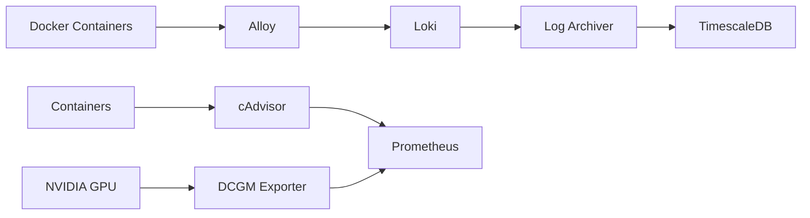

# Layer 0 - Data Collection & Storage

## Overview

Layer 0 是系統的數據基礎層，負責收集、聚合和永久存儲所有監控數據。

## Components

| Component | Purpose | Port |
|-----------|---------|------|
| [[Grafana Alloy]] | 日誌收集 | 12345 |
| [[Loki]] | 日誌聚合 | 3100 |
| [[TimescaleDB]] | 時序資料庫 | 5432 |
| [[Log Archiver]] | 日誌同步 | - |
| [[Prometheus]] | 指標監控 | 9090 |
| [[cAdvisor]] | 容器監控 | 8081 |
| [[DCGM Exporter]] | GPU 監控 | 9400 |

## Data Flow

## Responsibilities

1. **日誌收集** - 從所有 Docker 容器收集日誌
2. **日誌聚合** - 集中存儲和索引日誌
3. **永久存儲** - 將日誌同步到時序資料庫
4. **指標監控** - 收集 CPU、Memory、GPU 指標

## Storage

| Data Type | Storage | Retention |
|-----------|---------|-----------|
| Logs (short-term) | Loki | 31 days |
| Logs (long-term) | TimescaleDB | Permanent |
| Metrics | Prometheus | 15 days |

## Related Layers

- → [[Layer 1 - Anomaly Filtering]] - 消費日誌進行異常檢測
