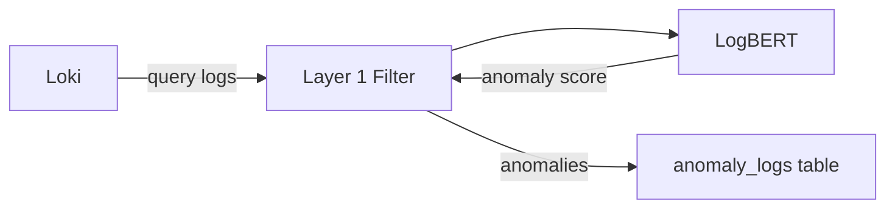

# Layer 1 - Anomaly Filtering

## Overview

Layer 1 負責從日誌流中識別異常，使用機器學習模型進行自動檢測。

## Components

| Component | Purpose |
|-----------|---------|
| [[Layer 1 Filter]] | 過濾服務主程式 |
| [[LogBERT]] | BERT 異常檢測引擎 |

## Data Flow



## Detection Pipeline

1. **Log Fetching** - 從 Loki 拉取最近的日誌
2. **Preprocessing** - 日誌正規化和分詞
3. **Scoring** - LogBERT 計算異常分數
4. **Filtering** - 閾值過濾 (default: 0.5)
5. **Storage** - 異常存儲到 PostgreSQL

## Configuration

```yaml
filters:
  - name: logbert
    threshold: 0.5    # Anomaly threshold
    batch_size: 50    # Batch processing size

polling:
  interval: 10        # seconds
  lookback: 60        # seconds
```

## Related Layers

- ← [[Layer 0 - Data Collection]] - 提供日誌數據
- → [[Layer 2 - Root Cause Analysis]] - 消費異常進行分析
