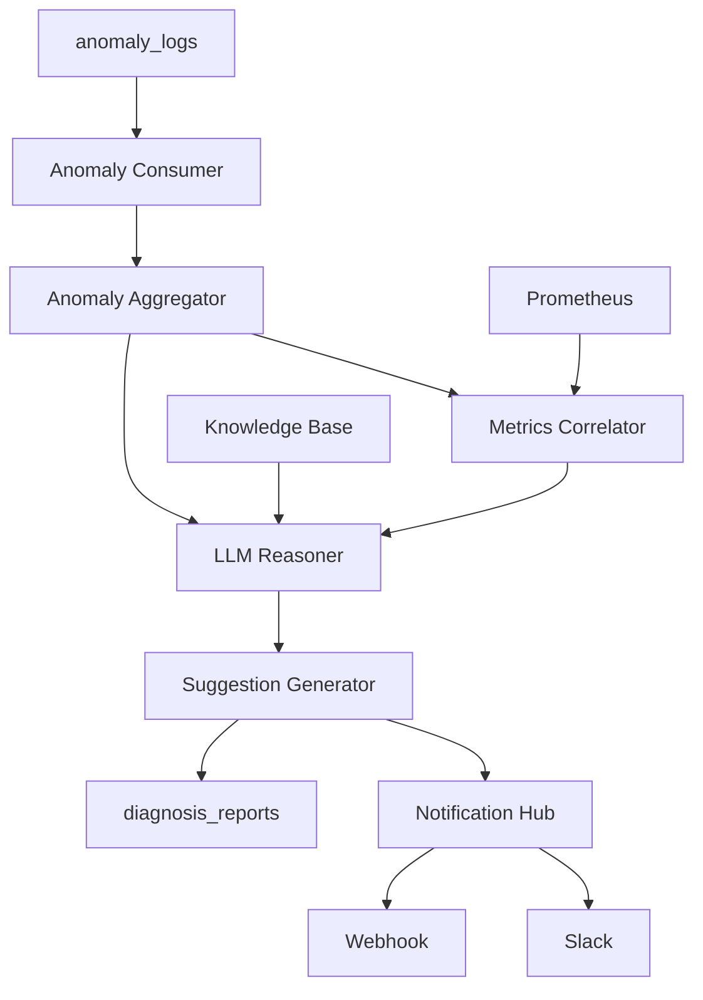

# Layer 2 - Root Cause Analysis

## Overview

Layer 2 是系統的智能核心，使用 LLM 進行根因分析，結合指標關聯和知識庫檢索。

## Components

| Component | Purpose |
|-----------|---------|
| [[Anomaly Consumer]] | 異常消費 |
| [[Anomaly Aggregator]] | 異常聚類 |
| [[Metrics Correlator]] | 指標關聯 |
| [[Knowledge Base]] | 知識庫 (ChromaDB) |
| [[LLM Reasoner]] | LLM 推理 |
| [[Suggestion Generator]] | 建議生成 |
| [[Notification Hub]] | 通知分發 |

## Data Flow

## Analysis Pipeline

1. **Consume** - 從資料庫讀取未處理的異常
2. **Aggregate** - 聚類相關異常
3. **Correlate** - 關聯系統指標
4. **Search** - 檢索知識庫相似案例
5. **Reason** - LLM 根因分析
6. **Generate** - 生成修復建議
7. **Notify** - 發送通知

## LLM Strategy

| Strategy | Description |
|----------|-------------|
| `cascade` | 本地分類 + 雲端深度分析 |
| `primary_only` | 僅使用 OpenAI |
| `local_only` | 僅使用 Ollama |

## Related Layers

- ← [[Layer 1 - Anomaly Filtering]] - 提供異常數據
- → [[Layer 3 - Remediation]] - 執行修復操作
