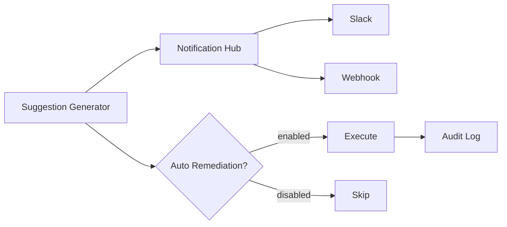

# Layer 3 - Remediation & Notification

## Overview

Layer 3 負責將診斷結果轉化為通知和（可選的）自動修復操作。

## Components

| Component | Purpose |
|-----------|---------|
| [[Notification Hub]] | 多通道通知 |
| [[Auto Remediation]] | 自動修復（預設關閉） |

## Notification Channels

| Channel | Description |
|---------|-------------|
| Slack | Incoming Webhook |
| Webhook | Custom HTTP endpoint |

## Auto Remediation

> ⚠️ **預設關閉** - 需要明確設置 `AUTO_REMEDIATION_ENABLED=true`

### Safety Rules

1. 只執行 `risk_level: low` 的操作
2. 只執行 `safe_to_automate: true` 的建議
3. 每容器每小時最多重啟 3 次
4. 所有操作都記錄審計日誌

### Safe Operations

| Operation | Safe to Auto |
|-----------|--------------|
| Health check | ✅ |
| Log collection | ✅ |
| Service restart | ✅ (with limits) |
| Config change | ❌ |
| Resource scaling | ❌ |

## Data Flow

## Related Layers

- ← [[Layer 2 - Root Cause Analysis]] - 提供診斷和建議
