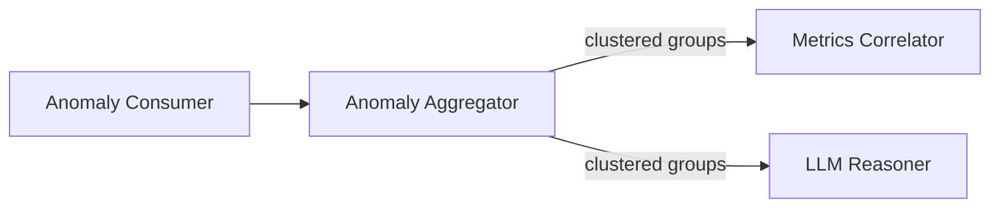

# Anomaly Aggregator

## Overview

Anomaly Aggregator 負責將來自 [[Anomaly Consumer]] 的異常進行聚類，將相關的異常歸為一組，避免重複分析。

## Role in System

- 時間窗口聚類（相近時間的異常）
- 模式識別（相似日誌訊息）
- 去重處理
- 生成異常群組供 [[LLM Reasoner]] 分析

## Source Code

**位置:** `layer2-analyzer/src/root_cause_analyzer/anomaly_aggregator.py`

```python
from datetime import datetime, timedelta
from collections import defaultdict
import hashlib

class AnomalyAggregator:
    def __init__(self):
        self.time_window = timedelta(minutes=5)
        self.similarity_threshold = 0.8
    
    def aggregate(self, anomalies: list[dict]) -> list[dict]:
        """Group related anomalies"""
        groups = []
        used = set()
        
        for i, anomaly in enumerate(anomalies):
            if i in used:
                continue
            
            group = {
                "primary": anomaly,
                "related": [],
                "containers": {anomaly["container"]},
                "time_range": (anomaly["timestamp"], anomaly["timestamp"])
            }
            
            for j, other in enumerate(anomalies[i+1:], i+1):
                if j in used:
                    continue
                
                if self._should_group(anomaly, other):
                    group["related"].append(other)
                    group["containers"].add(other["container"])
                    group["time_range"] = (
                        min(group["time_range"][0], other["timestamp"]),
                        max(group["time_range"][1], other["timestamp"])
                    )
                    used.add(j)
            
            groups.append(group)
            used.add(i)
        
        return groups
    
    def _should_group(self, a: dict, b: dict) -> bool:
        """Check if two anomalies should be grouped"""
        # Time proximity
        time_diff = abs((a["timestamp"] - b["timestamp"]).total_seconds())
        if time_diff > self.time_window.total_seconds():
            return False
        
        # Message similarity
        similarity = self._message_similarity(a["log_message"], b["log_message"])
        return similarity >= self.similarity_threshold
    
    def _message_similarity(self, msg1: str, msg2: str) -> float:
        """Calculate similarity between two log messages"""
        words1 = set(msg1.lower().split())
        words2 = set(msg2.lower().split())
        
        if not words1 or not words2:
            return 0.0
        
        intersection = len(words1 & words2)
        union = len(words1 | words2)
        
        return intersection / union  # Jaccard similarity
    
    def generate_group_id(self, group: dict) -> str:
        """Generate unique ID for anomaly group"""
        content = f"{group['primary']['container']}:{group['primary']['log_message']}"
        return hashlib.sha256(content.encode()).hexdigest()[:16]
```

## Clustering Strategy

### Time Window Clustering
- 預設時間窗口：5 分鐘
- 在窗口內的異常被歸為同一組

### Pattern-based Clustering
- 使用 Jaccard 相似度計算日誌訊息相似性
- 閾值：0.8（80% 相似）

### Deduplication
- 相同容器 + 相同訊息模式 = 去重
- 避免重複觸發 LLM 分析

## Configuration

| Environment Variable | Default | Description |
|---------------------|---------|-------------|
| `AGGREGATOR_TIME_WINDOW` | `300` | 時間窗口（秒） |
| `AGGREGATOR_SIMILARITY_THRESHOLD` | `0.8` | 相似度閾值 |

## Output Schema

聚類後的群組結構：

```json
{
  "group_id": "a1b2c3d4e5f67890",
  "primary": {
    "id": 123,
    "timestamp": "2026-04-08T10:30:00Z",
    "container": "api-server",
    "log_message": "Connection refused to database",
    "anomaly_score": 0.95
  },
  "related": [
    { "id": 124, ... },
    { "id": 125, ... }
  ],
  "containers": ["api-server", "worker"],
  "time_range": ["2026-04-08T10:28:00Z", "2026-04-08T10:32:00Z"],
  "count": 3
}
```

## Data Flow



## Related

- [[Anomaly Consumer]] - 上游組件
- [[Metrics Correlator]] - 指標關聯
- [[LLM Reasoner]] - 根因分析
