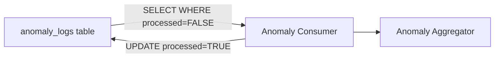

# Anomaly Consumer

## Overview

Anomaly Consumer 是 Layer 2 的入口組件，負責從 [[TimescaleDB]] 消費 [[Layer 1 Filter]] 檢測到的異常。

## Role in System

- 定期查詢未處理的異常
- 批次傳遞給 [[Anomaly Aggregator]]
- 標記已處理的異常

## Source Code

**位置:** `layer2-analyzer/src/anomaly_consumer.py`

```python
import asyncpg
from datetime import datetime, timedelta

class AnomalyConsumer:
    def __init__(self, db_url: str):
        self.db_url = db_url
        self.batch_size = 100
        self.poll_interval = 30  # seconds
    
    async def fetch_unprocessed(self) -> list[dict]:
        """Fetch unprocessed anomalies from database"""
        conn = await asyncpg.connect(self.db_url)
        try:
            rows = await conn.fetch('''
                SELECT id, timestamp, container, log_message, anomaly_score
                FROM anomaly_logs
                WHERE processed = FALSE
                ORDER BY timestamp DESC
                LIMIT $1
            ''', self.batch_size)
            return [dict(row) for row in rows]
        finally:
            await conn.close()
    
    async def mark_processed(self, anomaly_ids: list[int], diagnosis_id: str):
        """Mark anomalies as processed"""
        conn = await asyncpg.connect(self.db_url)
        try:
            await conn.execute('''
                UPDATE anomaly_logs
                SET processed = TRUE, diagnosis_id = $1
                WHERE id = ANY($2)
            ''', diagnosis_id, anomaly_ids)
        finally:
            await conn.close()
    
    async def run(self, callback):
        """Main consumer loop"""
        while True:
            anomalies = await self.fetch_unprocessed()
            if anomalies:
                await callback(anomalies)
            await asyncio.sleep(self.poll_interval)
```

## Configuration

| Environment Variable | Default | Description |
|---------------------|---------|-------------|
| `DATABASE_URL` | - | PostgreSQL 連接字串 |
| `CONSUMER_BATCH_SIZE` | `100` | 批次大小 |
| `CONSUMER_POLL_INTERVAL` | `30` | 輪詢間隔（秒） |

## Data Flow



## Related

- [[Layer 1 Filter]] - 異常來源
- [[Anomaly Aggregator]] - 下游處理
- [[TimescaleDB]] - 資料存儲
