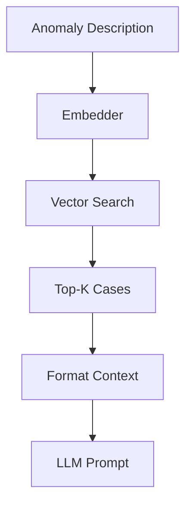

# Knowledge Base

## Overview

Knowledge Base 是基於 ChromaDB 的向量資料庫，存儲歷史診斷案例和解決方案，支援 RAG (Retrieval-Augmented Generation) 檢索。

## Role in System

- 存儲歷史診斷報告和解決方案
- 提供語義相似性搜索
- 為 [[LLM Reasoner]] 提供 RAG 上下文
- 支援持續學習（新案例自動加入）

## Source Code

**位置:** `layer2-analyzer/src/root_cause_analyzer/knowledge_base.py`

```python
import chromadb
from chromadb.config import Settings
from sentence_transformers import SentenceTransformer

class KnowledgeBase:
    def __init__(self, persist_dir: str = "./chroma_db"):
        self.client = chromadb.Client(Settings(
            chroma_db_impl="duckdb+parquet",
            persist_directory=persist_dir,
            anonymized_telemetry=False
        ))
        
        self.collection = self.client.get_or_create_collection(
            name="diagnosis_cases",
            metadata={"hnsw:space": "cosine"}
        )
        
        self.embedder = SentenceTransformer("all-MiniLM-L6-v2")
    
    def add_case(self, case: dict) -> str:
        """Add a diagnosis case to knowledge base"""
        case_id = case.get("id", str(uuid.uuid4()))
        
        # Create embedding from pattern + root cause
        text = f"{case['pattern']} {case['root_cause']}"
        embedding = self.embedder.encode(text).tolist()
        
        self.collection.add(
            ids=[case_id],
            embeddings=[embedding],
            documents=[text],
            metadatas=[{
                "pattern": case["pattern"],
                "root_cause": case["root_cause"],
                "solution": case["solution"],
                "severity": case.get("severity", "medium"),
                "created_at": datetime.utcnow().isoformat()
            }]
        )
        
        return case_id
    
    def search(self, query: str, n_results: int = 5) -> list[dict]:
        """Search for similar cases"""
        query_embedding = self.embedder.encode(query).tolist()
        
        results = self.collection.query(
            query_embeddings=[query_embedding],
            n_results=n_results,
            include=["documents", "metadatas", "distances"]
        )
        
        cases = []
        for i in range(len(results["ids"][0])):
            cases.append({
                "id": results["ids"][0][i],
                "document": results["documents"][0][i],
                "metadata": results["metadatas"][0][i],
                "similarity": 1 - results["distances"][0][i]  # cosine distance to similarity
            })
        
        return cases
    
    def get_rag_context(self, anomaly_description: str, top_k: int = 3) -> str:
        """Get RAG context for LLM"""
        cases = self.search(anomaly_description, n_results=top_k)
        
        if not cases:
            return "No similar historical cases found."
        
        context = "## Historical Cases\n\n"
        for i, case in enumerate(cases, 1):
            context += f"### Case {i} (Similarity: {case['similarity']:.2f})\n"
            context += f"**Pattern:** {case['metadata']['pattern']}\n"
            context += f"**Root Cause:** {case['metadata']['root_cause']}\n"
            context += f"**Solution:** {case['metadata']['solution']}\n\n"
        
        return context
```

## Embedding Model

- **Model:** `all-MiniLM-L6-v2`
- **Dimensions:** 384
- **Purpose:** 將文本轉換為向量表示

## Storage

### ChromaDB Collection

| Field | Type | Description |
|-------|------|-------------|
| `id` | string | 案例 ID |
| `embedding` | vector | 文本向量 |
| `document` | string | 原始文本 |
| `metadata.pattern` | string | 異常模式 |
| `metadata.root_cause` | string | 根因 |
| `metadata.solution` | string | 解決方案 |

### Persistence

```yaml
volumes:
  - ./chroma_data:/app/chroma_db
```

## RAG Flow



## Example RAG Context

```markdown
## Historical Cases

### Case 1 (Similarity: 0.92)
**Pattern:** Connection refused to database on port 5432
**Root Cause:** PostgreSQL service crashed due to OOM
**Solution:** Increase memory limit, add connection pooling

### Case 2 (Similarity: 0.85)
**Pattern:** Database connection timeout after 30s
**Root Cause:** Network partition between app and database
**Solution:** Check network policies, restart affected pods
```

## Configuration

| Environment Variable | Default | Description |
|---------------------|---------|-------------|
| `CHROMA_PERSIST_DIR` | `./chroma_db` | 持久化目錄 |
| `EMBEDDING_MODEL` | `all-MiniLM-L6-v2` | 嵌入模型 |
| `RAG_TOP_K` | `3` | 檢索數量 |

## Related

- [[LLM Reasoner]] - RAG 消費者
- [[TimescaleDB]] - 案例也存儲到 SQL
- [[Layer 2 - Root Cause Analysis]]

## References

- [ChromaDB Documentation](https://docs.trychroma.com/)
- [Sentence Transformers](https://www.sbert.net/)
