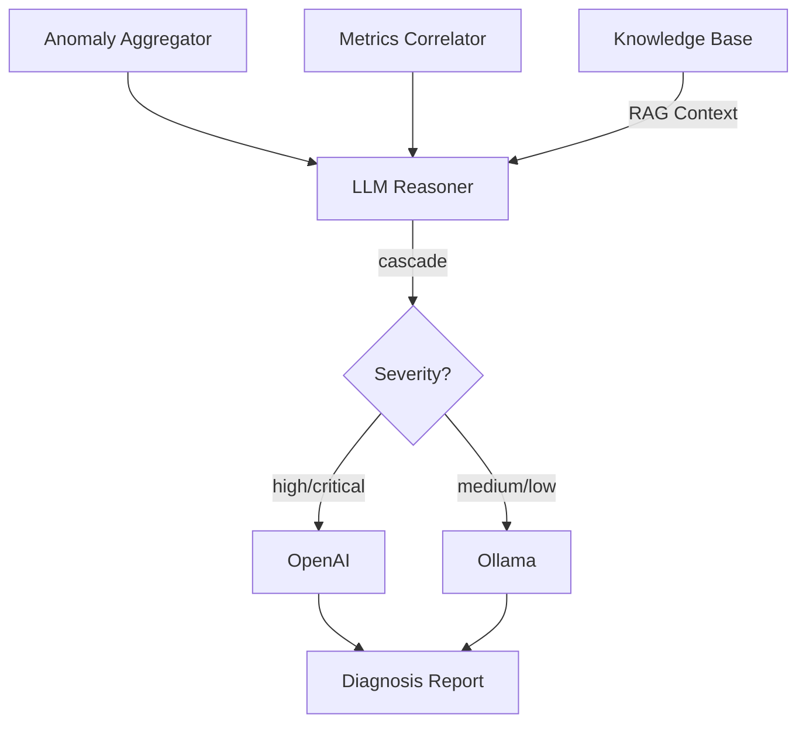

# LLM Reasoner

## Overview

LLM Reasoner 是 Layer 2 的核心分析組件，使用大型語言模型進行根因分析。支援 OpenAI API 和本地 Ollama 部署。

## Role in System

- 整合異常群組、指標上下文、知識庫
- 使用 LLM 進行根因推理
- 生成診斷報告
- 支援 Cascade 策略（本地 + 雲端）

## Source Code

**位置:** `layer2-analyzer/src/root_cause_analyzer/llm_reasoner.py`

```python
import os
from abc import ABC, abstractmethod
from typing import Optional

class LLMReasoner:
    def __init__(self):
        self.strategy = os.environ.get("LLM_STRATEGY", "cascade")
        self.primary_client = self._init_primary()
        self.local_client = self._init_local()
    
    def _init_primary(self):
        """Initialize primary LLM (OpenAI)"""
        from llm.openai_compatible import OpenAIClient
        return OpenAIClient(
            api_key=os.environ.get("OPENAI_API_KEY"),
            model=os.environ.get("OPENAI_MODEL", "gpt-4-turbo-preview")
        )
    
    def _init_local(self):
        """Initialize local LLM (Ollama)"""
        from llm.ollama import OllamaClient
        return OllamaClient(
            base_url=os.environ.get("OLLAMA_URL", "http://ollama:11434"),
            model=os.environ.get("OLLAMA_MODEL", "llama2")
        )
    
    async def analyze(
        self,
        anomaly_group: dict,
        metrics_context: dict,
        rag_context: str
    ) -> dict:
        """Perform root cause analysis"""
        
        prompt = self._build_prompt(anomaly_group, metrics_context, rag_context)
        
        if self.strategy == "cascade":
            # First pass: local classification
            classification = await self._local_classify(anomaly_group)
            
            # Second pass: deep analysis with primary LLM
            if classification["severity"] in ["high", "critical"]:
                result = await self.primary_client.complete(prompt)
            else:
                result = await self.local_client.complete(prompt)
        
        elif self.strategy == "primary_only":
            result = await self.primary_client.complete(prompt)
        
        elif self.strategy == "local_only":
            result = await self.local_client.complete(prompt)
        
        return self._parse_result(result)
    
    def _build_prompt(
        self,
        anomaly_group: dict,
        metrics_context: dict,
        rag_context: str
    ) -> str:
        """Build analysis prompt"""
        return f"""You are an expert SRE analyzing system anomalies.

## Anomaly Information

**Primary Anomaly:**
- Container: {anomaly_group['primary']['container']}
- Message: {anomaly_group['primary']['log_message']}
- Score: {anomaly_group['primary']['anomaly_score']}
- Time: {anomaly_group['primary']['timestamp']}

**Related Anomalies:** {len(anomaly_group.get('related', []))}
**Affected Containers:** {', '.join(anomaly_group['containers'])}

## System Metrics

{self._format_metrics(metrics_context)}

{rag_context}

## Task

Analyze the anomaly and provide:
1. **Root Cause**: Most likely root cause
2. **Severity**: critical/high/medium/low
3. **Impact**: What services/users are affected
4. **Suggestions**: Actionable remediation steps

Respond in JSON format:
{{
  "root_cause": "...",
  "severity": "...",
  "impact": "...",
  "suggestions": ["...", "..."]
}}
"""
    
    async def _local_classify(self, anomaly_group: dict) -> dict:
        """Quick local classification"""
        prompt = f"""Classify this anomaly severity:
Message: {anomaly_group['primary']['log_message']}
Respond with JSON: {{"severity": "critical|high|medium|low"}}"""
        
        result = await self.local_client.complete(prompt)
        return {"severity": result.get("severity", "medium")}
```

## LLM Strategies

| Strategy | Description | Use Case |
|----------|-------------|----------|
| `cascade` | 本地快速分類 + 雲端深度分析 | 預設，平衡成本與品質 |
| `primary_only` | 僅使用 OpenAI | 需要最高品質分析 |
| `local_only` | 僅使用 Ollama | 離線或成本敏感 |

## LLM Clients

### OpenAI Client

**位置:** `layer2-analyzer/src/llm/openai_compatible.py`

```python
import openai

class OpenAIClient:
    def __init__(self, api_key: str, model: str):
        self.client = openai.AsyncOpenAI(api_key=api_key)
        self.model = model
    
    async def complete(self, prompt: str) -> dict:
        response = await self.client.chat.completions.create(
            model=self.model,
            messages=[{"role": "user", "content": prompt}],
            response_format={"type": "json_object"}
        )
        return json.loads(response.choices[0].message.content)
```

### Ollama Client

**位置:** `layer2-analyzer/src/llm/ollama.py`

```python
import aiohttp

class OllamaClient:
    def __init__(self, base_url: str, model: str):
        self.base_url = base_url
        self.model = model
    
    async def complete(self, prompt: str) -> dict:
        async with aiohttp.ClientSession() as session:
            async with session.post(
                f"{self.base_url}/api/generate",
                json={"model": self.model, "prompt": prompt, "stream": False}
            ) as resp:
                data = await resp.json()
                return json.loads(data["response"])
```

## Configuration

| Environment Variable | Default | Description |
|---------------------|---------|-------------|
| `LLM_STRATEGY` | `cascade` | 策略選擇 |
| `OPENAI_API_KEY` | - | OpenAI API Key |
| `OPENAI_MODEL` | `gpt-4-turbo-preview` | OpenAI 模型 |
| `OLLAMA_URL` | `http://ollama:11434` | Ollama URL |
| `OLLAMA_MODEL` | `llama2` | Ollama 模型 |

## Output Schema

```json
{
  "root_cause": "PostgreSQL connection pool exhausted due to connection leak in user service",
  "severity": "high",
  "impact": "All API requests requiring database access are failing",
  "suggestions": [
    "Restart user-service to release leaked connections",
    "Increase connection pool size from 10 to 25",
    "Add connection timeout to prevent future leaks",
    "Review recent code changes for connection handling"
  ],
  "confidence": 0.85
}
```

## Data Flow



## Related

- [[OpenAI API]] - 雲端 LLM
- [[Ollama]] - 本地 LLM
- [[Knowledge Base]] - RAG 上下文
- [[Suggestion Generator]] - 下游處理

## References

- [OpenAI API Documentation](https://platform.openai.com/docs)
- [Ollama Documentation](https://ollama.ai/docs)
