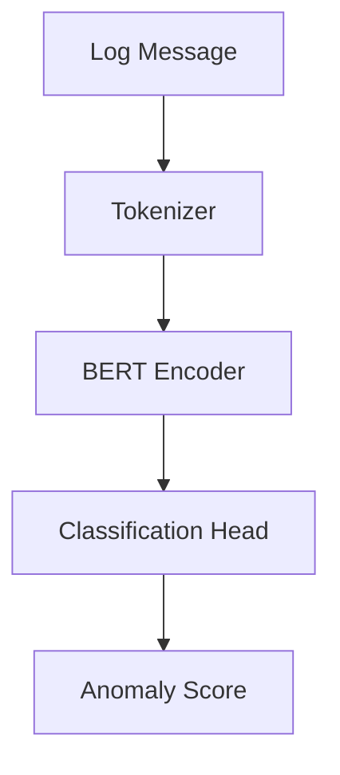

# LogBERT

## Overview

LogBERT 是基於 BERT (Bidirectional Encoder Representations from Transformers) 的日誌異常檢測引擎。它使用預訓練的語言模型理解日誌語義，識別異常模式。

## Role in System

- 為 [[Layer 1 Filter]] 提供異常分數
- 使用 Transformer 模型理解日誌語義
- 支援批次推理提高效率

## Architecture



## Source Code

**位置:** `logbert/src/`

### Anomaly Detector

`anomaly_detector.py`:
```python
import torch
from transformers import BertTokenizer, BertForSequenceClassification

class LogBERTDetector:
    def __init__(self, model_path: str = None):
        self.device = torch.device("cuda" if torch.cuda.is_available() else "cpu")
        self.tokenizer = BertTokenizer.from_pretrained("bert-base-uncased")
        
        if model_path:
            self.model = BertForSequenceClassification.from_pretrained(model_path)
        else:
            self.model = BertForSequenceClassification.from_pretrained(
                "bert-base-uncased",
                num_labels=2  # normal, anomaly
            )
        
        self.model.to(self.device)
        self.model.eval()
    
    def predict(self, logs: list[str]) -> list[float]:
        """Return anomaly scores for batch of logs"""
        inputs = self.tokenizer(
            logs,
            padding=True,
            truncation=True,
            max_length=512,
            return_tensors="pt"
        ).to(self.device)
        
        with torch.no_grad():
            outputs = self.model(**inputs)
            probs = torch.softmax(outputs.logits, dim=1)
            anomaly_scores = probs[:, 1].cpu().tolist()
        
        return anomaly_scores
    
    def predict_single(self, log: str) -> float:
        """Return anomaly score for single log"""
        return self.predict([log])[0]
```

### Log Processor

`log_processor.py`:
```python
import re

class LogProcessor:
    def __init__(self):
        self.patterns = {
            "timestamp": r"\d{4}-\d{2}-\d{2}[T ]\d{2}:\d{2}:\d{2}",
            "ip": r"\d{1,3}\.\d{1,3}\.\d{1,3}\.\d{1,3}",
            "uuid": r"[a-f0-9]{8}-[a-f0-9]{4}-[a-f0-9]{4}-[a-f0-9]{4}-[a-f0-9]{12}",
            "path": r"/[\w/.-]+",
            "number": r"\b\d+\b"
        }
    
    def normalize(self, log: str) -> str:
        """Normalize log by replacing variables with placeholders"""
        result = log
        for name, pattern in self.patterns.items():
            result = re.sub(pattern, f"<{name}>", result)
        return result
```

## Model Details

### Base Model
- **Architecture:** BERT-base-uncased
- **Parameters:** 110M
- **Input:** Tokenized log message (max 512 tokens)
- **Output:** Binary classification (normal/anomaly)

### Training

訓練資料位於 `logbert/data/`:
- `normal_logs.txt` - 正常日誌樣本
- `anomaly_logs.txt` - 異常日誌樣本

```python
# Training script
from transformers import Trainer, TrainingArguments

training_args = TrainingArguments(
    output_dir="./models",
    num_train_epochs=3,
    per_device_train_batch_size=16,
    learning_rate=2e-5,
    warmup_steps=500,
    weight_decay=0.01
)

trainer = Trainer(
    model=model,
    args=training_args,
    train_dataset=train_dataset,
    eval_dataset=eval_dataset
)

trainer.train()
```

## Docker Compose

```yaml
logbert:
  build:
    context: ./logbert
  environment:
    MODEL_PATH: /app/models/logbert-finetuned
    BATCH_SIZE: "32"
    DEVICE: "cuda"  # or "cpu"
  deploy:
    resources:
      reservations:
        devices:
          - driver: nvidia
            count: 1
            capabilities: [gpu]
  volumes:
    - ./logbert/models:/app/models
```

## Configuration

| Environment Variable | Default | Description |
|---------------------|---------|-------------|
| `MODEL_PATH` | `bert-base-uncased` | 模型路徑 |
| `BATCH_SIZE` | `32` | 批次大小 |
| `MAX_LENGTH` | `512` | 最大序列長度 |
| `DEVICE` | `cuda` | 計算設備 |

## API

LogBERT 可作為獨立服務運行，提供 HTTP API：

```python
from flask import Flask, request, jsonify

app = Flask(__name__)
detector = LogBERTDetector()

@app.route("/predict", methods=["POST"])
def predict():
    logs = request.json.get("logs", [])
    scores = detector.predict(logs)
    return jsonify({"scores": scores})

@app.route("/health", methods=["GET"])
def health():
    return jsonify({"status": "healthy"})
```

## Performance

| Metric | Value |
|--------|-------|
| Inference Time (batch=32) | ~50ms (GPU) |
| Accuracy | ~95% |
| Precision | ~93% |
| Recall | ~96% |

## Related

- [[Layer 1 Filter]] - 使用 LogBERT 的服務
- [[DCGM Exporter]] - GPU 監控
- [[Layer 2 - Root Cause Analysis]] - 下游分析

## References

- [BERT Paper](https://arxiv.org/abs/1810.04805)
- [LogBERT Paper](https://arxiv.org/abs/2103.04475)
- [Hugging Face Transformers](https://huggingface.co/docs/transformers)
