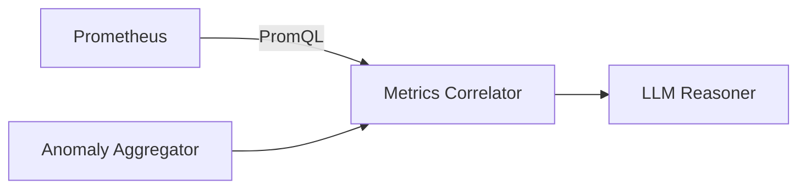

# Metrics Correlator

## Overview

Metrics Correlator 負責查詢 [[Prometheus]] 中的系統指標，並與異常事件進行時間關聯分析，提供額外的診斷上下文。

## Role in System

- 在異常發生時間查詢相關容器的 CPU/Memory 指標
- 查詢 GPU 指標（如有）
- 識別資源使用異常
- 提供指標上下文給 [[LLM Reasoner]]

## Source Code

**位置:** `layer2-analyzer/src/root_cause_analyzer/metrics_correlator.py`

```python
import aiohttp
from datetime import datetime, timedelta

class MetricsCorrelator:
    def __init__(self, prometheus_url: str):
        self.prometheus_url = prometheus_url
        self.lookback = timedelta(minutes=10)
        self.lookahead = timedelta(minutes=5)
    
    async def correlate(self, anomaly_group: dict) -> dict:
        """Fetch and correlate metrics for anomaly group"""
        start_time = anomaly_group["time_range"][0] - self.lookback
        end_time = anomaly_group["time_range"][1] + self.lookahead
        containers = anomaly_group["containers"]
        
        metrics = {}
        
        for container in containers:
            metrics[container] = {
                "cpu": await self._query_cpu(container, start_time, end_time),
                "memory": await self._query_memory(container, start_time, end_time),
                "network": await self._query_network(container, start_time, end_time)
            }
        
        # GPU metrics (if available)
        gpu_metrics = await self._query_gpu(start_time, end_time)
        if gpu_metrics:
            metrics["gpu"] = gpu_metrics
        
        # Analyze for anomalies
        analysis = self._analyze_metrics(metrics, anomaly_group["time_range"])
        
        return {
            "raw_metrics": metrics,
            "analysis": analysis
        }
    
    async def _query_prometheus(self, query: str, start: datetime, end: datetime) -> list:
        """Execute PromQL query"""
        url = f"{self.prometheus_url}/api/v1/query_range"
        params = {
            "query": query,
            "start": start.isoformat() + "Z",
            "end": end.isoformat() + "Z",
            "step": "15s"
        }
        
        async with aiohttp.ClientSession() as session:
            async with session.get(url, params=params) as resp:
                data = await resp.json()
                if data["status"] == "success":
                    return data["data"]["result"]
                return []
    
    async def _query_cpu(self, container: str, start: datetime, end: datetime) -> dict:
        """Query CPU metrics"""
        query = f'rate(container_cpu_usage_seconds_total{{name="{container}"}}[1m]) * 100'
        result = await self._query_prometheus(query, start, end)
        return self._extract_timeseries(result)
    
    async def _query_memory(self, container: str, start: datetime, end: datetime) -> dict:
        """Query memory metrics"""
        query = f'container_memory_working_set_bytes{{name="{container}"}} / 1024 / 1024'
        result = await self._query_prometheus(query, start, end)
        return self._extract_timeseries(result)
    
    async def _query_gpu(self, start: datetime, end: datetime) -> dict:
        """Query GPU metrics"""
        queries = {
            "utilization": "DCGM_FI_DEV_GPU_UTIL",
            "memory": "DCGM_FI_DEV_FB_USED / 1024",
            "temperature": "DCGM_FI_DEV_GPU_TEMP"
        }
        
        gpu_metrics = {}
        for name, query in queries.items():
            result = await self._query_prometheus(query, start, end)
            if result:
                gpu_metrics[name] = self._extract_timeseries(result)
        
        return gpu_metrics if gpu_metrics else None
    
    def _analyze_metrics(self, metrics: dict, anomaly_time: tuple) -> dict:
        """Analyze metrics for potential causes"""
        analysis = {
            "resource_issues": [],
            "correlations": []
        }
        
        for container, container_metrics in metrics.items():
            if container == "gpu":
                continue
            
            # Check for high CPU
            if container_metrics.get("cpu", {}).get("max", 0) > 80:
                analysis["resource_issues"].append({
                    "type": "high_cpu",
                    "container": container,
                    "value": container_metrics["cpu"]["max"]
                })
            
            # Check for high memory
            if container_metrics.get("memory", {}).get("max", 0) > 1000:  # MB
                analysis["resource_issues"].append({
                    "type": "high_memory",
                    "container": container,
                    "value": container_metrics["memory"]["max"]
                })
        
        return analysis
```

## PromQL Queries

### Container Metrics

| Metric | PromQL |
|--------|--------|
| CPU Usage (%) | `rate(container_cpu_usage_seconds_total{name="X"}[1m]) * 100` |
| Memory (MB) | `container_memory_working_set_bytes{name="X"} / 1024 / 1024` |
| Network RX | `rate(container_network_receive_bytes_total{name="X"}[1m])` |
| Network TX | `rate(container_network_transmit_bytes_total{name="X"}[1m])` |

### GPU Metrics

| Metric | PromQL |
|--------|--------|
| GPU Util (%) | `DCGM_FI_DEV_GPU_UTIL` |
| GPU Memory (GB) | `DCGM_FI_DEV_FB_USED / 1024` |
| GPU Temp (°C) | `DCGM_FI_DEV_GPU_TEMP` |

## Configuration

| Environment Variable | Default | Description |
|---------------------|---------|-------------|
| `PROMETHEUS_URL` | `http://prometheus:9090` | Prometheus API URL |
| `METRICS_LOOKBACK` | `600` | 往前查詢時間（秒） |
| `METRICS_LOOKAHEAD` | `300` | 往後查詢時間（秒） |

## Output Schema

```json
{
  "raw_metrics": {
    "api-server": {
      "cpu": { "avg": 45.2, "max": 78.5, "values": [...] },
      "memory": { "avg": 512, "max": 680, "values": [...] }
    },
    "gpu": {
      "utilization": { "avg": 65, "max": 95, "values": [...] }
    }
  },
  "analysis": {
    "resource_issues": [
      { "type": "high_cpu", "container": "api-server", "value": 78.5 }
    ],
    "correlations": []
  }
}
```

## Data Flow



## Related

- [[Prometheus]] - 指標來源
- [[cAdvisor]] - 容器指標
- [[DCGM Exporter]] - GPU 指標
- [[LLM Reasoner]] - 消費者
