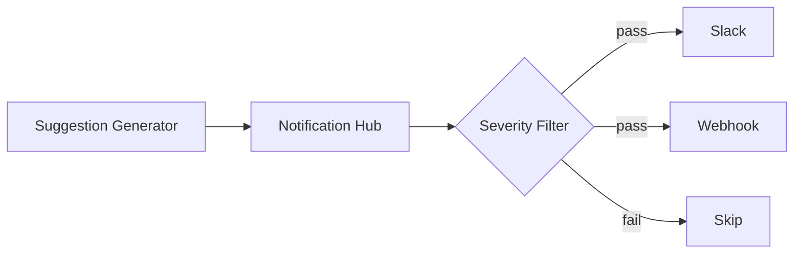

# Notification Hub

## Overview

Notification Hub 是多通道通知系統，負責將診斷結果和修復建議發送到各種通知渠道。

## Role in System

- 接收診斷報告
- 根據嚴重程度過濾
- 格式化通知訊息
- 發送到 Slack / Webhook

## Source Code

**位置:** `layer2-analyzer/src/notification_hub.py`

```python
import aiohttp
from abc import ABC, abstractmethod
from typing import Optional

class NotificationChannel(ABC):
    @abstractmethod
    async def send(self, message: dict) -> bool:
        pass

class SlackChannel(NotificationChannel):
    def __init__(self, webhook_url: str):
        self.webhook_url = webhook_url
    
    async def send(self, message: dict) -> bool:
        payload = self._format_slack_message(message)
        
        async with aiohttp.ClientSession() as session:
            async with session.post(self.webhook_url, json=payload) as resp:
                return resp.status == 200
    
    def _format_slack_message(self, message: dict) -> dict:
        severity_emoji = {
            "critical": ":rotating_light:",
            "high": ":warning:",
            "medium": ":large_yellow_circle:",
            "low": ":information_source:"
        }
        
        emoji = severity_emoji.get(message["severity"], ":question:")
        
        return {
            "blocks": [
                {
                    "type": "header",
                    "text": {
                        "type": "plain_text",
                        "text": f"{emoji} Anomaly Detected"
                    }
                },
                {
                    "type": "section",
                    "fields": [
                        {"type": "mrkdwn", "text": f"*Severity:* {message['severity']}"},
                        {"type": "mrkdwn", "text": f"*Container:* {message['container']}"}
                    ]
                },
                {
                    "type": "section",
                    "text": {
                        "type": "mrkdwn",
                        "text": f"*Root Cause:*\n{message['root_cause']}"
                    }
                },
                {
                    "type": "section",
                    "text": {
                        "type": "mrkdwn",
                        "text": f"*Suggestions:*\n" + "\n".join(f"• {s}" for s in message['suggestions'][:3])
                    }
                }
            ]
        }

class WebhookChannel(NotificationChannel):
    def __init__(self, url: str, headers: Optional[dict] = None):
        self.url = url
        self.headers = headers or {}
    
    async def send(self, message: dict) -> bool:
        async with aiohttp.ClientSession() as session:
            async with session.post(
                self.url,
                json=message,
                headers=self.headers
            ) as resp:
                return resp.status in [200, 201, 202]

class NotificationHub:
    def __init__(self):
        self.channels = []
        self.min_severity = os.environ.get("MIN_NOTIFY_SEVERITY", "medium")
        self._init_channels()
    
    def _init_channels(self):
        # Slack
        slack_url = os.environ.get("SLACK_WEBHOOK_URL")
        if slack_url:
            self.channels.append(SlackChannel(slack_url))
        
        # Custom webhook
        webhook_url = os.environ.get("WEBHOOK_URL")
        if webhook_url:
            self.channels.append(WebhookChannel(webhook_url))
    
    async def notify(self, diagnosis: dict) -> dict:
        """Send notification to all channels"""
        if not self._should_notify(diagnosis["severity"]):
            return {"sent": False, "reason": "severity_filter"}
        
        results = {}
        for channel in self.channels:
            channel_name = channel.__class__.__name__
            try:
                success = await channel.send(diagnosis)
                results[channel_name] = success
            except Exception as e:
                results[channel_name] = str(e)
        
        return {"sent": True, "results": results}
    
    def _should_notify(self, severity: str) -> bool:
        """Check if severity meets minimum threshold"""
        severity_order = ["low", "medium", "high", "critical"]
        min_idx = severity_order.index(self.min_severity)
        current_idx = severity_order.index(severity)
        return current_idx >= min_idx
```

## Notification Channels

### Slack

- 使用 Incoming Webhook
- 支援 Block Kit 格式
- 根據嚴重程度顯示不同 emoji

### Custom Webhook

- 通用 HTTP POST
- 支援自定義 headers
- JSON payload

## Configuration

**配置文件:** `layer3-remediation/config/notifications.yaml`

```yaml
notifications:
  min_severity: medium  # low, medium, high, critical
  
  slack:
    enabled: true
    webhook_url: ${SLACK_WEBHOOK_URL}
    channel: "#alerts"
  
  webhook:
    enabled: true
    url: ${WEBHOOK_URL}
    headers:
      Authorization: "Bearer ${WEBHOOK_TOKEN}"
```

## Environment Variables

| Variable | Description |
|----------|-------------|
| `SLACK_WEBHOOK_URL` | Slack Incoming Webhook URL |
| `WEBHOOK_URL` | 自定義 Webhook URL |
| `WEBHOOK_TOKEN` | Webhook 認證 Token |
| `MIN_NOTIFY_SEVERITY` | 最低通知嚴重程度 |

## Slack Message Format

```
🚨 Anomaly Detected

Severity: critical
Container: api-server

Root Cause:
PostgreSQL connection pool exhausted due to connection leak

Suggestions:
• Restart user-service to release leaked connections
• Increase connection pool size from 10 to 25
• Review recent code changes
```

## Severity Filter

| Min Severity | Notified Levels |
|--------------|-----------------|
| `low` | low, medium, high, critical |
| `medium` | medium, high, critical |
| `high` | high, critical |
| `critical` | critical only |

## Data Flow



## Related

- [[Suggestion Generator]] - 上游組件
- [[Layer 3 - Remediation]] - 修復層
- [[Dashboard]] - Web UI 也顯示診斷
