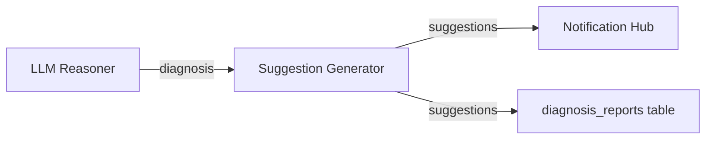

# Suggestion Generator

## Overview

Suggestion Generator 根據 [[LLM Reasoner]] 的診斷結果生成具體的修復建議，結合規則引擎和 LLM 增強。

## Role in System

- 接收 LLM 診斷結果
- 應用預定義的修復規則
- 生成具體可執行的建議
- 標記安全性等級

## Source Code

**位置:** `layer2-analyzer/src/suggestion_generator.py`

```python
from typing import Optional
from dataclasses import dataclass

@dataclass
class Suggestion:
    action: str
    command: Optional[str]
    risk_level: str  # low, medium, high
    safe_to_automate: bool
    category: str

class SuggestionGenerator:
    def __init__(self):
        self.rules = self._load_rules()
    
    def _load_rules(self) -> dict:
        """Load predefined remediation rules"""
        return {
            "dependency_failure": [
                Suggestion(
                    action="Restart dependent service",
                    command="docker restart {service}",
                    risk_level="low",
                    safe_to_automate=True,
                    category="restart"
                ),
                Suggestion(
                    action="Check service health",
                    command="docker inspect {service} --format='{{.State.Health}}'",
                    risk_level="low",
                    safe_to_automate=True,
                    category="diagnostic"
                )
            ],
            "resource_exhaustion": [
                Suggestion(
                    action="Increase memory limit",
                    command="docker update --memory={new_limit} {service}",
                    risk_level="medium",
                    safe_to_automate=False,
                    category="scaling"
                ),
                Suggestion(
                    action="Clear cache",
                    command=None,
                    risk_level="low",
                    safe_to_automate=True,
                    category="cleanup"
                )
            ],
            "configuration_error": [
                Suggestion(
                    action="Review configuration file",
                    command=None,
                    risk_level="low",
                    safe_to_automate=False,
                    category="diagnostic"
                ),
                Suggestion(
                    action="Restart with corrected config",
                    command="docker-compose up -d {service}",
                    risk_level="medium",
                    safe_to_automate=False,
                    category="restart"
                )
            ],
            "network_issue": [
                Suggestion(
                    action="Check network connectivity",
                    command="docker exec {service} ping -c 3 {target}",
                    risk_level="low",
                    safe_to_automate=True,
                    category="diagnostic"
                ),
                Suggestion(
                    action="Restart network stack",
                    command="docker network disconnect {network} {service} && docker network connect {network} {service}",
                    risk_level="medium",
                    safe_to_automate=False,
                    category="network"
                )
            ]
        }
    
    def generate(self, diagnosis: dict) -> list[dict]:
        """Generate suggestions based on diagnosis"""
        suggestions = []
        
        # Extract category from root cause
        category = self._categorize_root_cause(diagnosis["root_cause"])
        
        # Get rule-based suggestions
        if category in self.rules:
            for rule in self.rules[category]:
                suggestion = {
                    "action": rule.action,
                    "command": self._interpolate_command(rule.command, diagnosis),
                    "risk_level": rule.risk_level,
                    "safe_to_automate": rule.safe_to_automate,
                    "category": rule.category,
                    "source": "rule"
                }
                suggestions.append(suggestion)
        
        # Add LLM suggestions
        for llm_suggestion in diagnosis.get("suggestions", []):
            suggestions.append({
                "action": llm_suggestion,
                "command": None,
                "risk_level": "medium",
                "safe_to_automate": False,
                "category": "llm",
                "source": "llm"
            })
        
        return suggestions
    
    def _categorize_root_cause(self, root_cause: str) -> str:
        """Categorize root cause into predefined categories"""
        root_cause_lower = root_cause.lower()
        
        if any(kw in root_cause_lower for kw in ["connection", "timeout", "refused", "unreachable"]):
            return "dependency_failure"
        elif any(kw in root_cause_lower for kw in ["memory", "cpu", "oom", "resource", "exhausted"]):
            return "resource_exhaustion"
        elif any(kw in root_cause_lower for kw in ["config", "setting", "invalid", "missing"]):
            return "configuration_error"
        elif any(kw in root_cause_lower for kw in ["network", "dns", "routing"]):
            return "network_issue"
        
        return "unknown"
    
    def _interpolate_command(self, command: Optional[str], diagnosis: dict) -> Optional[str]:
        """Interpolate variables in command template"""
        if not command:
            return None
        
        # Extract service name from diagnosis
        container = diagnosis.get("container", "unknown")
        
        return command.format(
            service=container,
            target="localhost",
            network="default",
            new_limit="2g"
        )
```

## Suggestion Categories

| Category | Description | Examples |
|----------|-------------|----------|
| `dependency_failure` | 依賴服務失敗 | Connection refused, Timeout |
| `resource_exhaustion` | 資源耗盡 | OOM, CPU throttling |
| `configuration_error` | 配置錯誤 | Invalid config, Missing env |
| `network_issue` | 網路問題 | DNS failure, Network partition |

## Risk Levels

| Level | Description | Auto-Remediation |
|-------|-------------|------------------|
| `low` | 唯讀/監控操作 | 可自動執行 |
| `medium` | 服務重啟 | 需人工確認 |
| `high` | 數據修改 | 絕不自動執行 |

## Output Schema

```json
{
  "suggestions": [
    {
      "action": "Restart dependent service",
      "command": "docker restart api-server",
      "risk_level": "low",
      "safe_to_automate": true,
      "category": "restart",
      "source": "rule"
    },
    {
      "action": "Review recent code changes for connection handling",
      "command": null,
      "risk_level": "medium",
      "safe_to_automate": false,
      "category": "llm",
      "source": "llm"
    }
  ]
}
```

## Data Flow



## Related

- [[LLM Reasoner]] - 上游診斷
- [[Notification Hub]] - 通知下游
- [[Auto Remediation]] - 自動修復（預設關閉）
