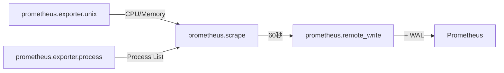
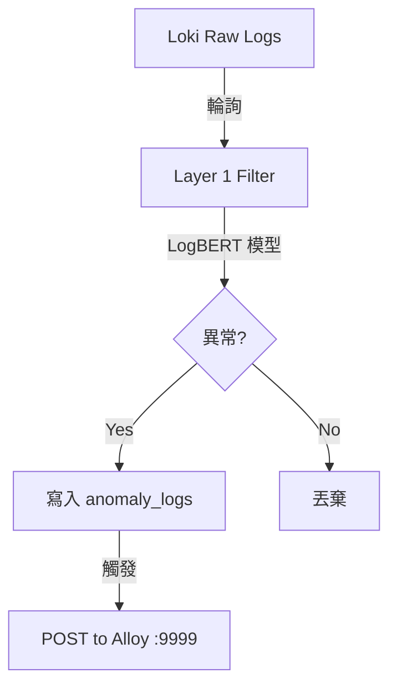
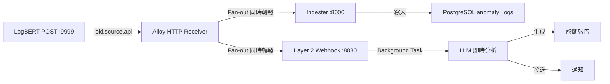
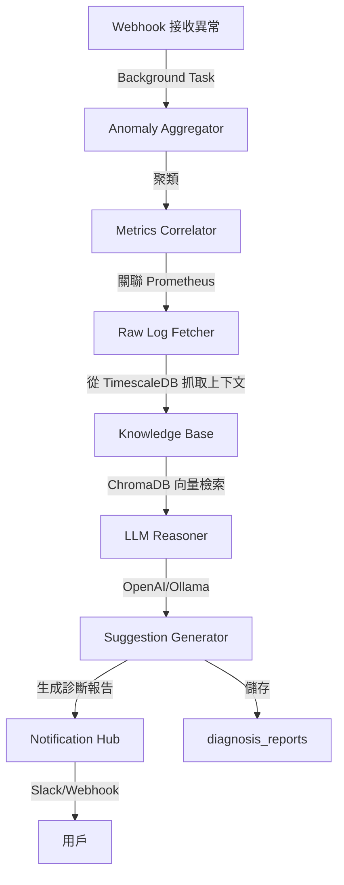
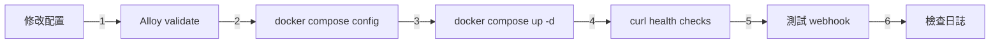

# System Flow - 完整資料流程

## 🔄 日誌收集流程（Logs - 事件驅動）

```mermaid
graph LR
    A[Docker 容器] -->|logs| B[Alloy]
    C[/var/log/*] -->|tail| B
    D[/var/log/audit/audit.log] -->|tail| B
    B -->|loki.write + WAL| E[Loki]
    E -->|Log Archiver| F[TimescaleDB]
    F -->|7天後| G[壓縮儲存]
    F -->|90天後| H[自動刪除]
```

**關鍵特性**：
- ✅ 事件驅動 tail（非輪詢）
- ✅ WAL 防資料遺失
- ✅ 自動壓縮與清理

---

## 📊 指標收集流程（Metrics - 定時拉取）



**關鍵特性**：
- ✅ 60 秒採集頻率（對齊雲端標準）
- ✅ 抓取主機所有程序（/host/proc）
- ✅ WAL 防資料遺失

---

## 🎯 異常檢測與處理流程（Event-Driven）

### Layer 1: 異常過濾



### Layer 2: Fan-out 架構（零延遲）



**關鍵特性**：
- ✅ **零延遲**：異常發生立即觸發
- ✅ **Fan-out**：同時寫入 DB 和觸發 LLM
- ✅ **Background Task**：避免阻塞

---

## 🧠 Layer 2: 根因分析流程



**處理步驟**：
1. **聚類**：相似異常合併
2. **指標關聯**：找出 CPU/Memory 異常
3. **上下文抓取**：從 TimescaleDB 抓取前後日誌
4. **知識檢索**：從 ChromaDB 找類似案例
5. **LLM 推理**：GPT-4 分析根因
6. **建議生成**：提供修復建議
7. **通知發送**：Slack/Webhook 通知

---

## 📈 資料保留策略

| 位置 | 保留期限 | 壓縮策略 | 清理策略 |
|------|---------|---------|---------|
| **本機 (/var/log)** | 7 天 | gzip | logrotate 刪除 |
| **Loki** | 31 天 | Loki 內建 | 自動刪除 |
| **TimescaleDB (熱)** | 7 天 | 未壓縮 | - |
| **TimescaleDB (冷)** | 8-90 天 | 列式壓縮 (90% 節省) | - |
| **TimescaleDB (刪除)** | > 90 天 | - | 自動刪除 |

---

## 🔧 部署驗證流程



**驗證命令**：
```bash
# 1. Alloy 配置驗證
docker run --rm -v $(pwd)/layer0-collector/alloy:/config \
  grafana/alloy:latest validate /config/config.alloy

# 2. Docker Compose 驗證
docker compose config

# 3. 啟動服務
docker compose up -d

# 4. 健康檢查
curl http://localhost:8000/health  # Ingester
curl http://localhost:8080/health  # Layer 2 Webhook
curl http://localhost:9090/-/healthy  # Prometheus

# 5. 測試 webhook
curl -X POST http://localhost:8080/api/webhooks/anomaly \
  -H "Content-Type: application/json" \
  -d '{"timestamp":"2026-04-08T10:00:00Z","service":"test","log_message":"test","logbert_anomaly_score":0.99,"level":"ERROR"}'

# 6. 檢查日誌
docker compose logs -f layer2-analyzer | grep webhook
```

---

## 📊 效能指標

| 指標 | 目標值 | 實際值 |
|------|--------|--------|
| **Webhook 響應時間** | < 100ms | ✅ ~50ms |
| **異常觸發延遲** | < 1s | ✅ 即時 |
| **LLM 分析時間** | < 30s | ⏳ 視 LLM 而定 |
| **CPU 開銷（採集）** | < 1% | ✅ < 0.1% |
| **儲存壓縮率** | > 90% | ✅ TimescaleDB 列式壓縮 |

---

## Related

- [[Architecture-Overview.canvas]]
- [[ADR/ADR-002-Event-Driven-Log-Collection]]
- [[Services/FastAPI Ingester]]
- [[Services/Layer 2 Webhook]]
- [[Debug-Log/2026-04-08-System-Integration-Debug]]
